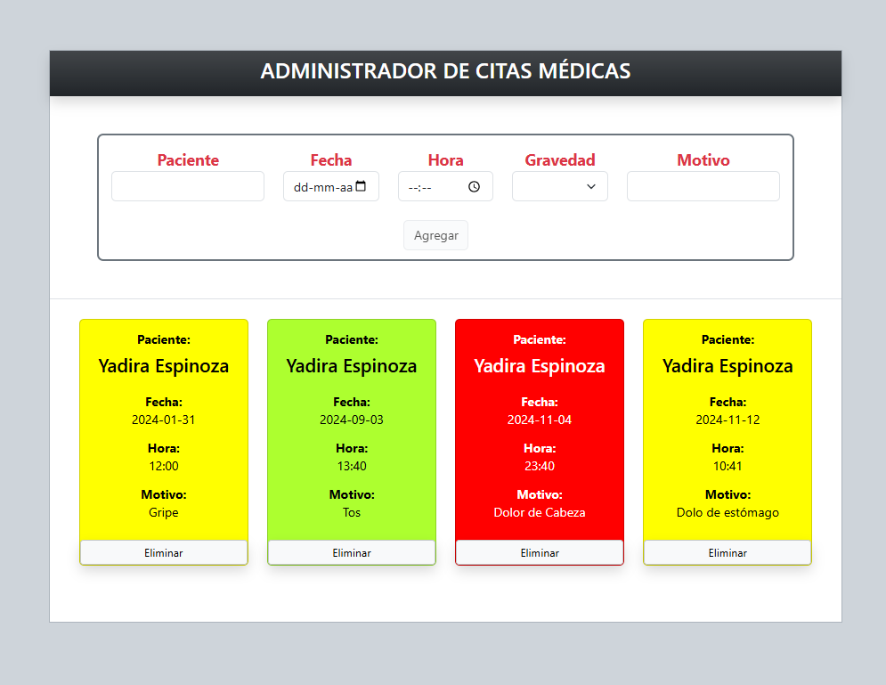

# **APPLICATION FOR MANAGING MEDICAL APPOINTMENTS**

This application can be used to manage appointments. Each time you add an appointment, it is displayed at the bottom in a table.

## **Technologies Used**
- **Vue.js**
- **JavaScript**
- **Bootstrap**
- **HTML5**
- **CSS3**

---

## **Features**
- **Reactive Form and Dynamic Validation**  
  - Form fields.  
  - The `labels` of the form turn red if the corresponding field is empty and return to black when filled.  
  - The "Add" button is enabled only when all fields are filled.  

- **Dynamic Message Rendering**  
  - Displays an indicative message when no appointments are registered.  
  - This message disappears after the first appointment is registered.  

- **Automatic Form Clearing**  
  - The form fields are automatically cleared after adding an appointment.  

- **Appointment Display in Card Format**  
  - Each registered appointment is displayed as a card with a dynamic and visually appealing design.  

- **Conditional Styles Based on Severity**  
  - The background color of each card changes according to the severity level of the appointment:  
    - **Low**: Green.  
    - **Medium**: Yellow.  
    - **High**: Red.  

- **Using Props to Pass Data**  
  - Appointment data is passed as `props` to child components for rendering.  

- **Interaction with the "Delete" Button**  
  - Each card has a "Delete" button that emits an event to the parent component to remove the appointment from the list.  

- **Component Reusability**  
  - Modular implementation with reusable components for appointment cards.  

- **Event Handling and Component Communication**  
  - Uses events emitted by child components to update the parent's state.  

---

## **Screenshots**
<p align="center">
  
</p>

---

## **Installation**
1.	Start proyect
```bash
npm run dev


